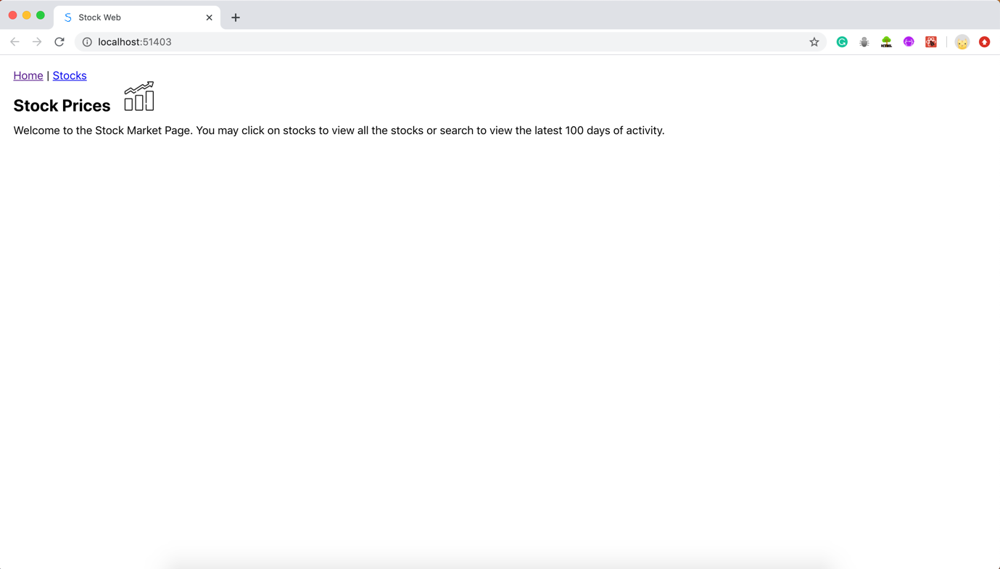
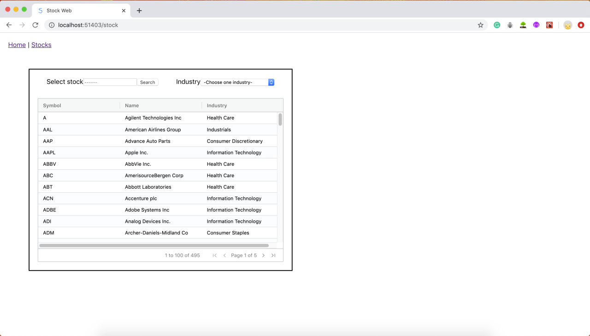
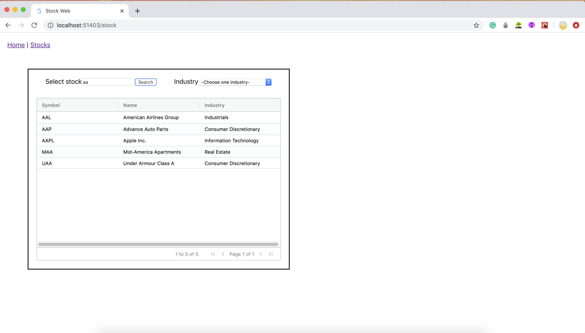
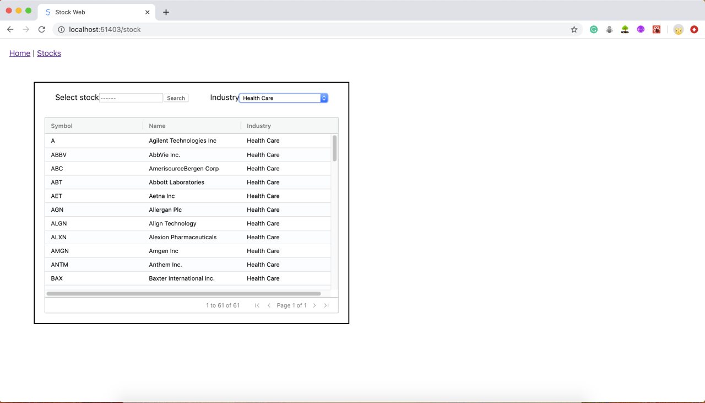
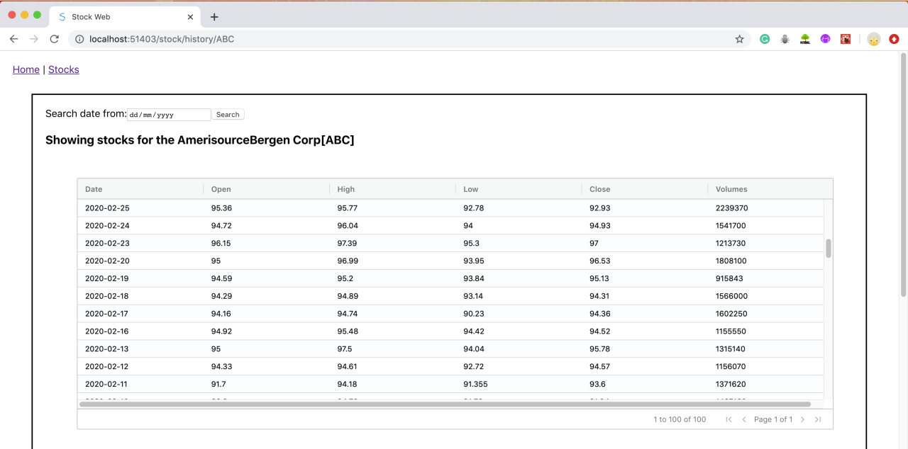
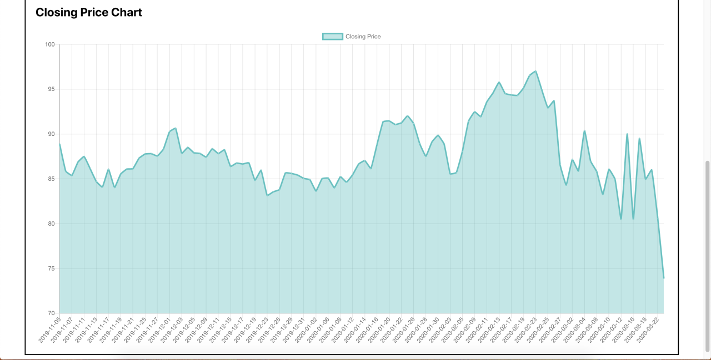
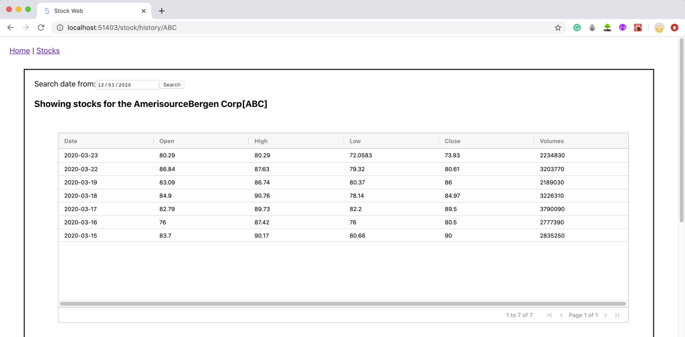
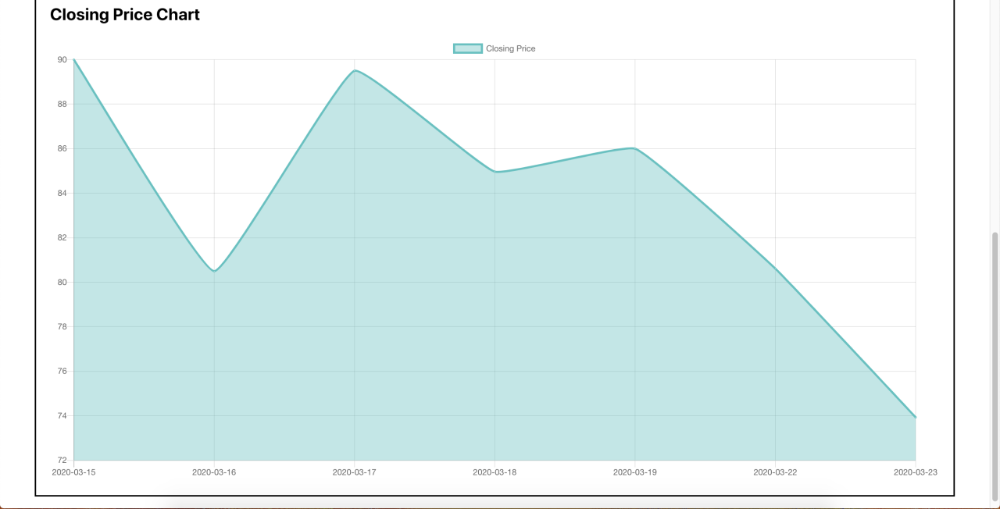

### A-Web-Application-of-Stock-Market

###### A Web Application that makes stock market statistics available to the user

###### User Guide

1. On the “Landing page” which has header, image and stock exchange information, you can click the link named “Stocks” on the header to navigate the stock page. 

## 

2. After clicking the link named “Stocks, it redirects to the stock main page with all stock data in the table. Pagination is applied as well. 

   

3. You can type any characters (it is case-insensitive) on the text field and then click “search” button to select stocks. All matching data will be displayed. 

   

4. Also, you can select a particular industry category so that all matching data with the particular industry will be displayed in the table. Pagination is applied as well. 

5. You can click the stock code or company name to go to the page of individual stock page. For example, when you click stock code named “ ABC”, you will redirect to the page as below. The information in the table includes of date, open price, high price, low price, close price and volumes for the particular stock. Pagination is applied as well. Moreover, we can see a line chart below the table. 

   

6. You can narrow down the recodes through selecting the begin date for the individual stock. For example, you selected the date from “12/03/2020”, and click the “Search” button, you can see only 7 records which are from “12/03/2020” being presented. We can see a line chart below which demonstrates current table data is displayed below the table. 

   

